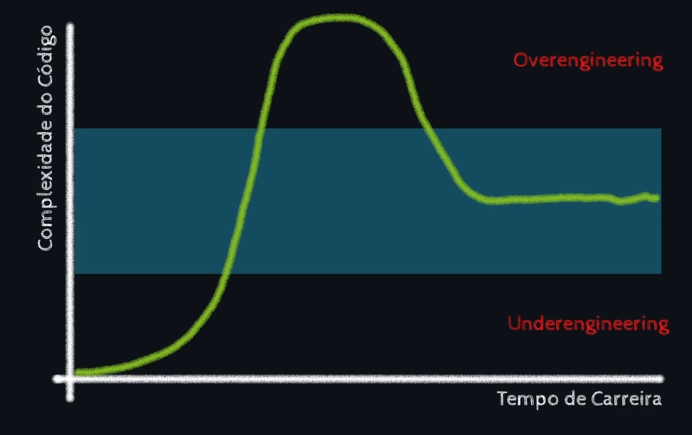

Arquivos rc são um tipo especial de arquivo do tipo "Run Commands" e é uma convenção para scripts de inicialização.

Arquivos rc são um tipo especial de arquivo do tipo "Run Commands" e é uma convenção para scripts de inicialização.

Over Engineering - Complicar demais algo que poderia ser simples.

Feature Creep - Quando um projeto tem tanto recurso que mais atrapalha do que ajuda.

Meta#1 - Organizar projeto

Criar um gitpages para esse projeto ?

Documentar por ali talvez seja uma boa ideia para não perder a mão no que eu deveria estar fazendo e de fato estou, organizar.

\*Para organizar tarefas, posso usar os recursos de milestone e issues do github.
A milestone é como se fosse um marco dos projetos e as issues são pequenas tarefas que compõem esses marcos, então eu posso relacionar uma issue a uma milestone e verificar todas as issues que compoẽm uma milestone.

editorconfig - É um configurador de editor, sendo então uma forma de padronizar como você escreve o código enquanto escreve, basicamente você cria um arquivo que pode ser lido por editores para que independente da máquina que o código está sendo escrito, detalhes como espaçamento sejam corrigidos pelo editor ao respeitar os padrões do arquivo .editorconfig (Que pode ser commitado), desde que o editor tenha suporte ou possa ser instalada a extensão para ler o arquivo(caso do vs code). É amplamente aceito.

o comando root = true serve para indicar aonde a leitura do arquivo deve parar. isso pq ele vasculha as pastas em busca de arquivos .editorconfig e permite que você tenha uma configuração para cada pasta por exemplo.

[.] significa que ele vai aplicar a todo tipo de arquivo, mas é possível escolher padrões específicos pra linguagens especificas digitando[.js] por exemplo para arquivos javascript.

npm install prettier -D (adiciona o prettier no package.jason como dependência de desenvolvimento)

Status Pages do projeto até então:
Vercel: https://www.vercel-status.com/
AWS: https://health.aws.amazon.com/health/status
GitHub: https://www.githubstatus.com/

POC - Prova de conceito/Proff of concept

Linha da simplicidade de código ideal:

Arquitetura de software não é sinônimo de organização de pastas.
É possível implementar MVC e Clean Architecture dentro de uma mesma pasta, ou todos os códigos de todos os tipos de componentes no mesmo arquivo, isso porque separar códigos em arquivos e organizar em pastas não é o que define uma arquitetura de software. O que define é o escopo dos componentes, onde eles começam e terminam em conjunto com o tipo de interação entre eles. E cada arquitetura é uma tentativa de definir esse escopo e essas interações.

TDD- Test Driven Development

Jest - É um framework de testes automatizados, considerado simples de se usar e com foco em testar aplicações escritas em react, mas foi otimizado para outras línguas também.

npm run test:watch //Comando para rodar o jest no modo watch.

Ele tem como concorrentes o Mocha(serial), o AVA(paralelo),Playwright (testes end-to-end)

O arquivo de testes é como um arco, e você é o arqueiro, quando você lança uma flecha (um teste) através do arco (arquivo de teste escrito) você espera que a flecha (O objeto de teste) encontre o alvo (que é o comportamento que você deseja que seja executado) e o arco é a sua forma de direcionar a flecha para o alvo. Então ao escrever um código de testes, você vai indicar que algo é um teste, o nome do teste e a função que se deseja testar. sendo possível inclusive fazê-lo dentro de arrow function.

test("nomeDoTeste",callbackFunction); //test é uma palavra reservada para entender que ali virá um teste, o primeiro parâmetro é o nome do teste e o segundo é a função que será executada.

O Hardcoded é um valor esperado, "Escrito em pedra" e o gerado durante a execução do código é chamado de Softcoded, que são valores gerados dinamicamente.

Pirâmide de testes:

Testes não possuem a capacidade de dizer se um código está funcionando ou não, mas sim a capacidade de dizer se um comportamento foi conforme o esperado.

A palavra reservada "expect" serve para evidenciar um comportamento esperado. "toBe" é outra palavra reservada com a mesma intenção, mas um diz espero e o outro diz seja. Juntos ficam algo como espero que X seja Y por exemplo.

Dentro da arquitetura MVC, o model será uma caixa de ferramentas e cada ferramenta é um model que pode fazer algo útil para construir um sistema.

Podendo então ser importado onde e quando você quiser. Mas para que outra parte do sistema consiga importar a função, é preciso primeiro exportar ela.

exports.somar = somar; //exportando a função somar

Nessa porta foi usado um padrão chamado CommonJS, que é o padrão de módulos do Node.js. Ele é o padrão mais comum para exportar funções e variáveis de um arquivo para outro.

Transpiling é o processo de converter o código de um arquivo de um formato para outro. No caso do Node.js, o código é convertido de CommonJS para JavaScript moderno.

API é uma interface que um robô ou script consegue ler de uma forma mais fácil.

TUI: Text-based User Interface → Interface de Usuário baseado em Texto
GUI: Graphical User Interface → Interface de Usuário Gráfica.

Criando um EndPoint:
Importante lembrar que o next usa um file based routing, ou seja o rotiamento dos endpoints será configurada por arquivos. Então por convenção, tudo colocado dentro da pasta pages em uma pasta chamada api, virará uma rota pública na API do site.

Crie uma pasta chamada status

E depois o seguinte código:

function status(request, response) {
return response.status(200).json({ teste: "TESTE TABNEWS OLÁ A TODOS" });
// return response.status(200).send("TESTE TABNEWS OLÁ A TODOS" );
}

export default status;

Qual a diferença de .json(), .send()? A diferença principal para um e outro é que o .send() não interpreta o charset-utf8 e mostra uma Sting na tela, enquanto o json além de criar um json ele interpreta o charset-utf8

Caso voce queira ver as informações que estão sendo passadas no request e sendo trazidas pelo response utilize o seguinte codigo para isso curl --verbose http://localhost:3000/api/status ele trará toda as informações do request e response (protcolo HTTP):
